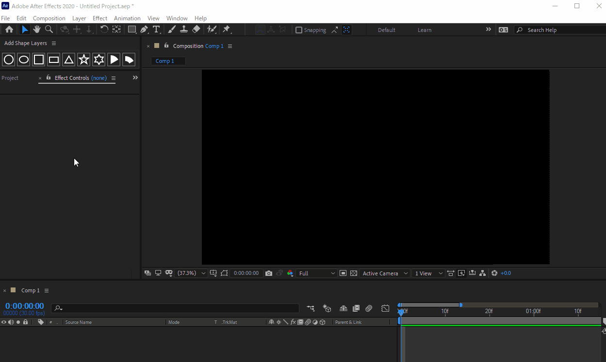

# Liesegang's AE Scripts

## 導入方法

1. [リリース](https://github.com/Liesegang/liesegangs_aescripts/releases/)から最新の `liesegangs_aescripts.zip` をダウンロード
2. `.jsxbin` または `.jsx` ファイルとLiesegangフォルダを `(After Effectsがインストールされているフォルダ)\Support Files\Scripts\ScriptUI Panels` に展開

デフォルトの場所は `C:\Program Files\Adobe\Adobe After Effects <バージョン>\Support Files\Scripts\ScriptUI Panels` になります．

## Add Shape Layers
シェイプをワンクリックで追加します．よく使うプロパティが，エフェクトとして追加されます．

図形は，

+ 円
+ 楕円
+ 正方形
+ 長方形
+ 正三角形
+ 五芒星
+ 六芒星
+ 扇形
+ 環状扇型

に対応しています．

扇型，環状扇型のみ，境界線に非対応です．
