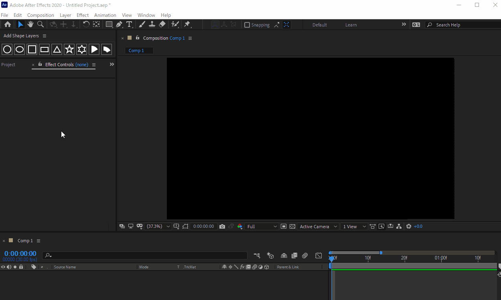

# Liesegang's AE Scripts

## 導入方法

1. [リリース](https://github.com/Liesegang/liesegangs_aescripts/releases/)から最新の `liesegangs_aescripts.zip` をダウンロード
2. zipを展開し，`Scripts`フォルダ内のすべてのファイル，フォルダを`(After Effectsがインストールされているフォルダ)\Support Files\Scripts` にコピー
    + デフォルトの場所は `C:\Program Files\Adobe\Adobe After Effects <バージョン>\Support Files\Scripts\ScriptUI Panels` になります．
3. 必要に応じて，`!`から始まるスクリプトにショートカットキーを割り当てる．
    + [こちらのページ](https://sites.google.com/view/youuu4/script%E5%B0%8E%E5%85%A5%E6%96%B9%E6%B3%95ae#h.p_CRVg-gE4sgMp)を参考にしてください

## 説明

### Add Shape Layers
シェイプをワンクリックで追加します．よく使うプロパティが，エフェクトとして追加されます．

図形は，

+ 円
+ 楕円
+ 正方形
+ 長方形
+ 正三角形
+ 五芒星
+ 六芒星
+ 扇形
+ 環状扇型

に対応しています．

扇型，環状扇型のみ，境界線に非対応です．

### ShortcutScripts
ショートカットキーを割り当てることを前提に作ったスクリプトです．
本来After Effectsではショートカットキーを割り当てられない操作(ヌルとそれを親としたカメラを，ショートカットキーで追加したいなど)にショートカットキーを割り当てるときに使います．
スクリプトにショートカットキーを割り当てる方法は，[こちらのページ](https://sites.google.com/view/youuu4/script%E5%B0%8E%E5%85%A5%E6%96%B9%E6%B3%95ae#h.p_CRVg-gE4sgMp)を参考にしてください

#### !00AddNullAndCam
ヌルとそれを親としたカメラを挿入する．Nullが上になります．

#### !01ToggleFill
選択しているレイヤーのうち，すべてのテキストレイヤーのFill，すべてのシェイプレイヤー内のすべてのFillの表示，非表示を反転します．

#### !02ToggleStroke
選択しているレイヤーのうち，すべてのテキストレイヤーのStroke，すべてのシェイプレイヤー内のすべてのStrokeの表示，非表示を反転します．

## Change Logs
### ShortcutScripts
#### !00AddNullAndCam
+ 1.0.1
  + カメラの中心位置がずれる問題を修正しました．

#### !01ToggleFill
+ 1.1.0
  + テキストレイヤーに対応
  + UndoGroupに対応

#### !02ToggleStroke
+ 1.1.0
  + テキストレイヤーに対応
  + UndoGroupに対応

### ScriptUI Panels
